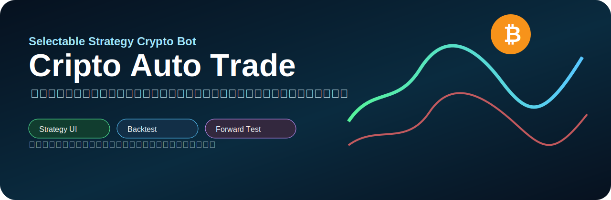
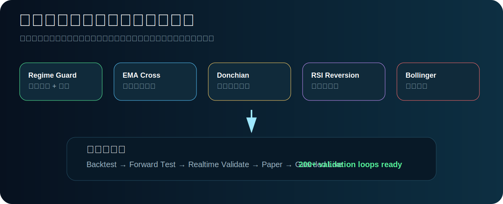
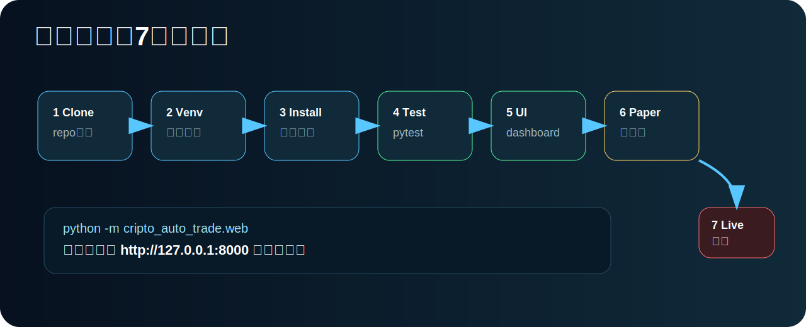
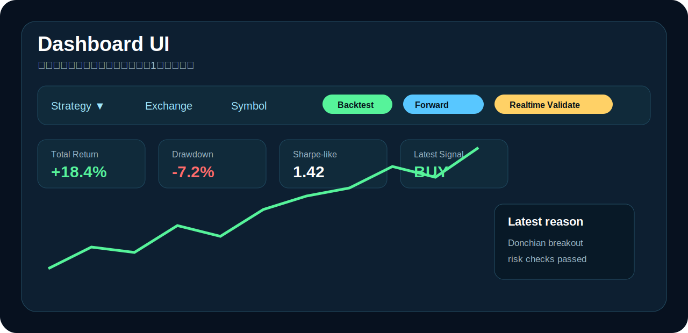
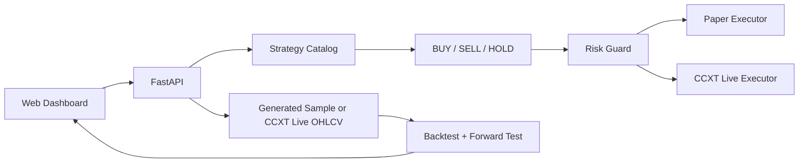

# Cripto Auto Trade



A simple, visual crypto auto-trading repository with selectable strategies, backtesting, forward testing, real-time validation, paper trading, and guarded live trading.

> This is trading software, not a profit guarantee. Start with backtest and paper mode. Live trading can lose money.

## What you can do



- Choose a trading strategy from the UI.
- Compare backtest and forward-test results.
- Validate strategy health with live OHLCV data through CCXT.
- Run paper trading before live trading.
- Use guarded live trading only when API keys and live acknowledgement are set.
- Keep the screen simple: strategy, symbol, timeframe, result cards, chart, latest signal.

## Quick start



```bash
git clone https://github.com/univcorp2-ctrl/cripto-auto-trade.git
cd cripto-auto-trade
python -m venv .venv
source .venv/bin/activate
pip install -e '.[dev,web,live]'
pytest
python -m cripto_auto_trade.cli validate --iterations 200
python -m cripto_auto_trade.web
```

Open `http://127.0.0.1:8000`.

## Simple dashboard



## Strategies users can choose

| Strategy | Best case | Weakness | Default role |
|---|---|---|---|
| `regime_guard` | Mixed market, trend + range + shock filter | More conservative | Recommended default |
| `ema_cross` | Clean trend | Whipsaw in ranges | Simple trend follow |
| `donchian_trend` | Strong breakouts | False breakouts | Momentum/trend |
| `rsi_reversion` | Ranging majors | Dangerous in strong downtrend | Mean reversion |
| `bollinger_breakout` | Volatility expansion | Fake breakout | Breakout timing |

```bash
python -m cripto_auto_trade.cli list-strategies
python -m cripto_auto_trade.cli backtest --strategy regime_guard
python -m cripto_auto_trade.cli forward-test --strategy regime_guard
python -m cripto_auto_trade.cli validate --iterations 200
python -m cripto_auto_trade.cli realtime --exchange binance --symbol BTC/USDT --timeframe 1h --strategy regime_guard --live-data
```

## Guarded live trading

```bash
export EXCHANGE_ID=binance
export EXCHANGE_API_KEY='your_key'
export EXCHANGE_API_SECRET='your_secret'
export CRIPTO_AUTO_TRADE_LIVE_ACK='I_UNDERSTAND_THIS_CAN_LOSE_MONEY'
python -m cripto_auto_trade.cli live-once --strategy regime_guard --exchange binance --symbol BTC/USDT --timeframe 1h --quote-order-size 15
```

Use exchange API keys with withdrawals disabled. Start with very small size.

## Architecture



## Important security note

Never paste GitHub tokens, exchange API keys, or secrets into chat, issues, README, commits, or logs. If a token is exposed, revoke it and create a new one.

## License

MIT
