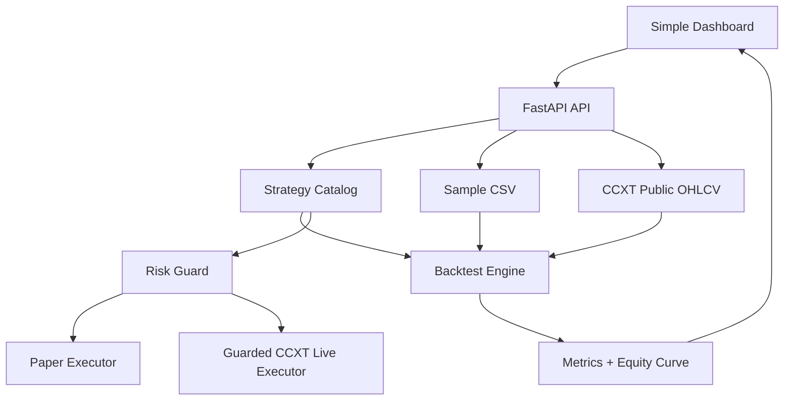

# Architecture

## Design goals

- UI first.
- Strategy selection is explicit.
- Backtest, forward test, and real-time validation use the same strategy engine.
- Live trading is locked behind environment variables.
- Validation can run hundreds of deterministic loops.

## Why FastAPI + static UI

FastAPI serves the API and static files. The frontend is plain HTML/CSS/JS for simplicity and easy GitHub review.
