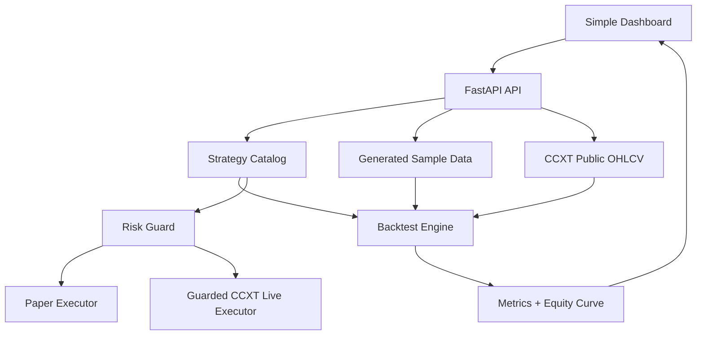

# Architecture

## Design goals

- UI first.
- Strategy selection is explicit.
- Backtest, forward test, and real-time validation use the same strategy engine.
- Live trading is locked behind environment variables.
- Validation can run hundreds of deterministic loops.

## Runtime flow

1. User selects strategy and market.
2. API loads generated sample candles or live OHLCV via CCXT.
3. Strategy generates BUY / SELL / HOLD target-position signals.
4. Backtester simulates fee, slippage, equity curve, trades, drawdown and Sharpe-like score.
5. UI displays metrics and chart.
6. Paper/live executors reuse the same signal and risk guard.
